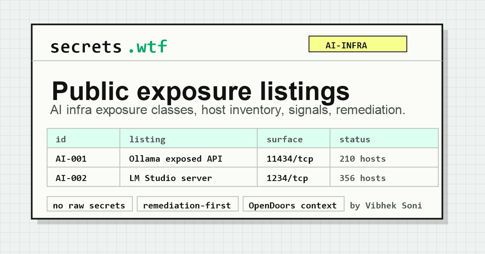

<p align="center">
  <a href="https://secrets.wtf/">
    
  </a>
</p>

# secrets.wtf

Public exposure listings for AI infrastructure.

[secrets.wtf](https://secrets.wtf/) is a defensive security index for publicly reachable AI model API surfaces, starting with [Ollama](https://secrets.wtf/listings/ollama/) and [LM Studio](https://secrets.wtf/listings/lm-studio/) hosts. The project helps operators, researchers, and defenders find exposed local LLM infrastructure, verify remediation, and track common exposure patterns.

Maintained by [Vibhek Soni](https://vibheksoni.com/) (`vibheksoni` / `@ImVibhek`), a New York backend systems builder and security researcher focused on AI infrastructure, browser automation, protocol analysis, MCP tooling, Python, Rust, and Go.

## Links

| Resource | URL |
| --- | --- |
| Live site | [secrets.wtf](https://secrets.wtf/) |
| Ollama listing | [secrets.wtf/listings/ollama](https://secrets.wtf/listings/ollama/) |
| LM Studio listing | [secrets.wtf/listings/lm-studio](https://secrets.wtf/listings/lm-studio/) |
| Research context | [OpenDoors](https://opendoors.wtf/) |
| Maintainer | [Vibhek Soni](https://vibheksoni.com/) |

## What This Is

`secrets.wtf` is a public host inventory for exposed AI infrastructure. It is built for defensive awareness, responsible cleanup, and security research.

The current focus is:

- exposed Ollama API hosts
- exposed LM Studio local servers
- OpenAI-compatible local LLM APIs
- model observations from public host inventories
- public exposure tracking for local AI tooling
- takedown and cleanup requests from host owners

## What This Is Not

This project is not for abuse.

Do not use listed hosts to run workloads, harvest data, test private systems, bypass controls, or interfere with services you do not own. The goal is to document public exposure and help reduce it.

## Current Listings

| Listing | Surface | Hosts | Data |
| --- | --- | ---: | --- |
| [Ollama exposed API](https://secrets.wtf/listings/ollama/) | Port `11434` | 94 | [`ollama.json`](data/hosts/ollama.json) |
| [LM Studio local server](https://secrets.wtf/listings/lm-studio/) | Port `1234` | 87 | [`lmstudio.json`](data/hosts/lmstudio.json) |

Each listing page supports filtering, pagination, local host additions, and export for review.

## Why It Exists

Local AI tools are often run for testing, development, or internal workflows. When these services bind to public interfaces, they can become reachable from the internet without the operator realizing it.

This project gives that exposure a clear public record:

- operators can find and fix their own exposed services
- researchers can study common AI infrastructure exposure patterns
- defenders can understand which local LLM surfaces are commonly reachable
- fixed or dead hosts can be removed through a clear request path

## Add Hosts Or Categories

Pull requests are welcome.

Good contributions include:

- verified Ollama or LM Studio exposure observations
- removal of dead, false-positive, or remediated hosts
- model observations where available
- new AI infrastructure exposure categories
- improvements to listing UI, pagination, filtering, or data handling
- related OpenDoors research links
- metadata, accessibility, or GitHub Pages fixes

For a new category:

1. Add a page under `listings/<category>/`.
2. Add a JSON inventory under `data/hosts/`.
3. Add the category to the homepage.
4. Add the page to `sitemap.xml`.
5. Keep wording compact, factual, and remediation-focused.

## Host Takedown Requests

If you own or operate a listed host and want it removed, open a GitHub issue:

[Request host removal](https://github.com/vibheksoni/secrets-wtf/issues/new/choose)

Please include:

- the exact host, IP, URL, or endpoint
- the listing where it appears
- a short ownership or operator note
- whether the service was secured, firewalled, shut down, or listed by mistake

Removal requests are welcome. Do not include credentials, tokens, customer data, private screenshots, or unrelated sensitive details in issues or pull requests.

## Local Development

This is a static GitHub Pages site.

```powershell
python -m http.server 8080
```

Open:

```text
http://localhost:8080/
```

## Project Structure

```text
.
|-- index.html
|-- listings/
|   |-- ollama/
|   `-- lm-studio/
|-- data/
|   `-- hosts/
|       |-- ollama.json
|       `-- lmstudio.json
|-- js/
|-- styles/
|-- sitemap.xml
|-- robots.txt
`-- CNAME
```

## Related Work

- Portfolio: [vibheksoni.com](https://vibheksoni.com/)
- Blog: [opendoors.wtf](https://opendoors.wtf/)
- GitHub: [github.com/vibheksoni](https://github.com/vibheksoni)
- X: [@ImVibhek](https://x.com/ImVibhek)
- Support: [Buy Me a Coffee](https://buymeacoffee.com/vibheksoni)

## License And Use

Use this project responsibly. The public listings are intended for awareness, remediation, and defensive security research.
